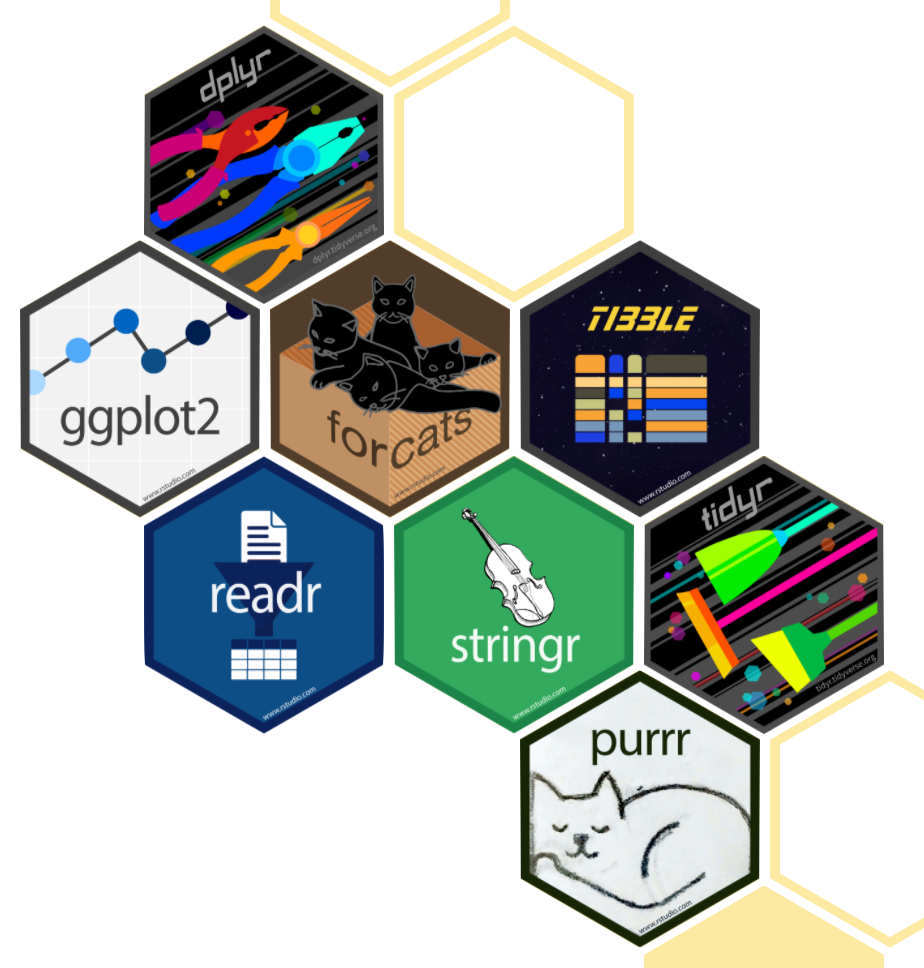
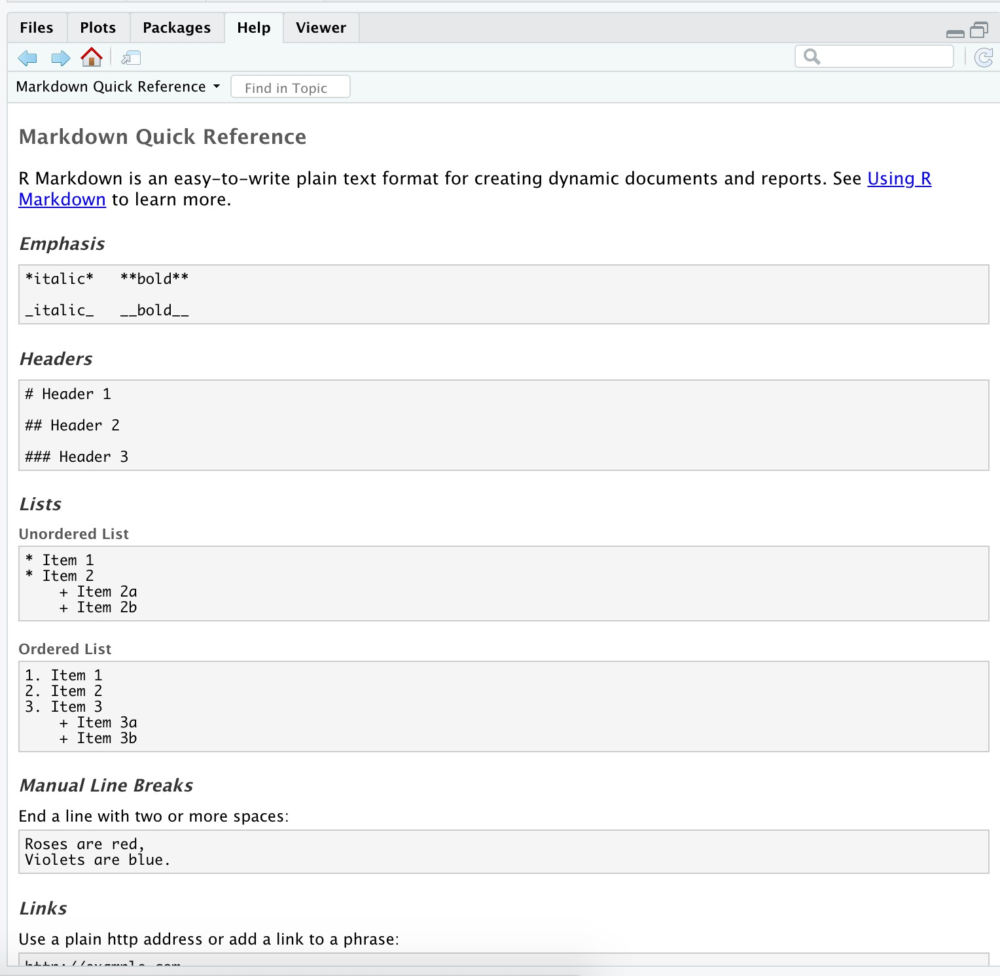
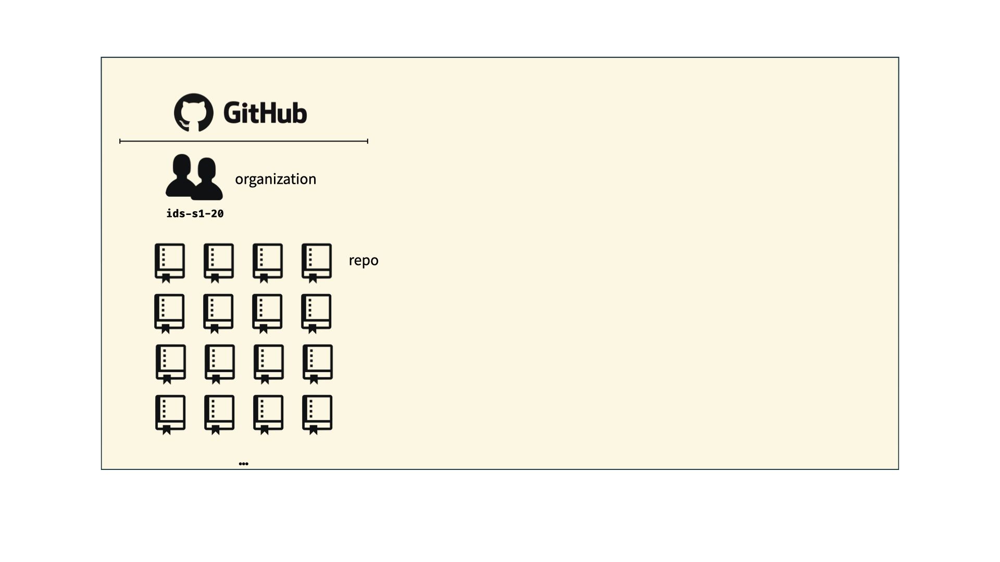
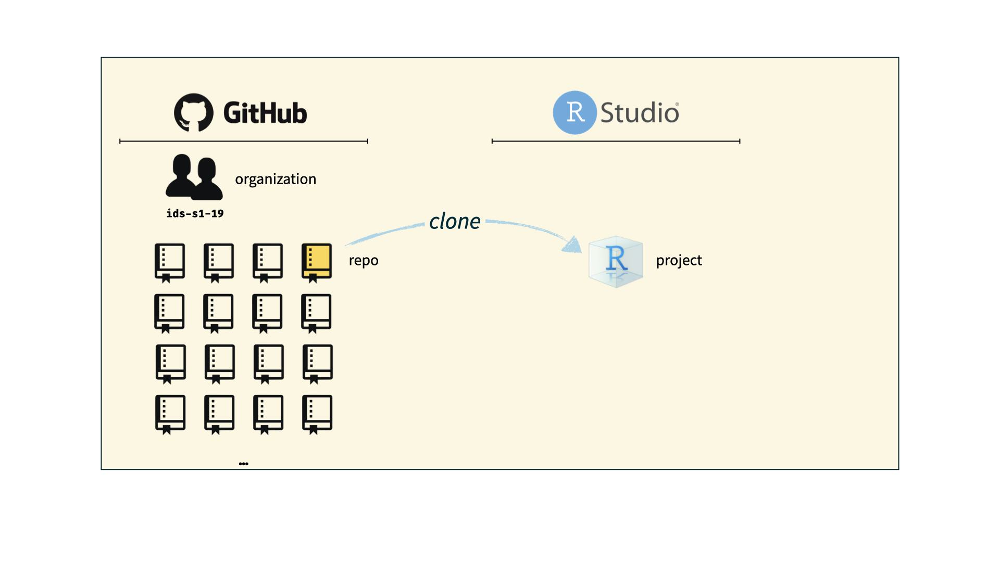

```{r child = "../setup.Rmd"}
```
```{r packages, message=FALSE, warning=FALSE, include=FALSE}
library(tidyverse)
library(emo)
packageVersion("xaringan")
library(viridis)
library(sugrrants)
library(lubridate)
```

## Learning goals

By the end of the workshop, you will...

- Have a general understanding of *what* R, RStudio and RStudio Server are. 
- Be able to access the new RStudio Server on our campus. 
- Understand reproducibility and why its an important piece of all of this!
- Web scrape using *Inspector Gadget* in Google Chrome combined with the *rvest* package in R
- Understand what data *cleaning* is all about. Specifically understand the *dplyr* functions
- Run some text analysis and gain some insight on our scraped data


---

class: middle

# Data and Software

---

# Data! This is technically Excel...
```{r echo=FALSE, out.width="65%", fig.align="left"}
knitr::include_graphics("img/excel.png")
```

---

# R programming
```{r echo=FALSE, out.width="40%", fig.align="left"}
knitr::include_graphics("img/r.png")
```
Go [here](https://www.r-project.org/) to install on your own machine at another time. 

---

# R programming

"R is a free software environment for statistical computing and graphics. It compiles and runs on a wide variety of UNIX platforms, Windows and MacOS." [r-project](https://www.r-project.org/)

- This is still true but drastically understates its usefulness
- Since R is free, people add to it using R *packages*.
"Packages are the fundamental units of reproducible R code. They include reusable R functions, the documentation that describes how to use them, and sample data." [R Packages](https://r-pkgs.org/index.html)
- At this point, at over 18 thousands packages there are packages for almost every imaginable purpose. This includes in the Arts and Humanities!
- Packages are a collection of functions, and often datasets to use as examples in those functions. 

---

# R Package Examples
Education
[PsychBrief](https://psychbrief.com/r-packages-education/),
[learnr](https://rstudio.github.io/learnr/)

English: Anything text analysis! 
[Project Gutenberg](https://www.gutenberg.org/),
[gutenbergr](https://cran.r-project.org/web/packages/gutenbergr/vignettes/intro.html)

History 
[Programming Historian](https://programminghistorian.org/en/), 
[Jesse Sadler](https://www.rstudio.com/resources/rstudioconf-2019/learning-and-using-the-tidyverse-for-historical-research/)

Language
[languageR](https://cran.r-project.org/web/packages/languageR/languageR.pdf)

#### These clearly overlap! 

---

# R Studio
```{r echo=FALSE, out.width="55%", fig.align="left"}
knitr::include_graphics("img/rstudio.png")
```
Go [here](https://www.rstudio.com/products/rstudio/download/) to install on your own machine at another time. 

---

# R Markdown
```{r echo=FALSE, out.width="65%", fig.align="left"}
knitr::include_graphics("img/unvotes/unvotes.gif")
```

---

# R Markdown

"R Markdown documents are fully reproducible. Use a productive notebook interface to weave together narrative text and code to produce elegantly formatted output. Use multiple languages including R, Python, and SQL." [R Markdown](https://rmarkdown.rstudio.com/)

- Long story short, we will use RMarkdown as a built in extension to our RStudio. 
- There is change coming to this soon. R Studio has released [quarto](https://quarto.org/)

---

# RStudio Server

- Click [turing.cornellcollege.edu:8787/](http://turing.cornellcollege.edu:8787) to access the RStudio Server on campus. 
- No installation necessary!
- You only need a web browser - you can technically use this on your phones!
- You need to be on campus or use the campus VPN on your work computers
- This runs from a powerful server machine on our campus taken care of by Ajit Chavan in computer science
- Block 8 is our final test block for using it with teaching
- If there is enough interest we will setup one for student and faculty research and another for classes.

---

## Your new toolkit

- .pink[Programming:]
  - .pink[R]
  - .pink[RStudio]
   - .pink[tidyverse]
   - .pink[R Markdown (another day)]

---

class: middle

# Reproducible data analysis

---

## Reproducibility checklist

.question[
What does it mean for a data analysis to be "reproducible"?
]

--

Near-term goals:

- Are the tables and figures reproducible from the code and data?
- Does the code actually do what you think it does?
- In addition to what was done, is it clear *why* it was done? 

Long-term goals:

- Can the code be used for other data?
- Can you extend the code to do other things?

---

## Toolkit for reproducibility

- Scriptability $\rightarrow$ R
- Literate programming (code, narrative, output in one place) $\rightarrow$ R Markdown
- Version control $\rightarrow$ Git / GitHub

---

class: middle

# R and RStudio

---

## R and RStudio

.pull-left[
```{r echo=FALSE, out.width="25%"}
knitr::include_graphics("img/r-logo.png")
```
- R is an open-source statistical **programming language**
- R is also an environment for statistical computing and graphics
- It's easily extensible with *packages*
]
.pull-right[
```{r echo=FALSE, out.width="50%"}
knitr::include_graphics("img/rstudio-logo.png")
```
- RStudio is a convenient interface for R called an **IDE** (integrated development environment), e.g. *"I write R code in the RStudio IDE"*
- RStudio is not a requirement for programming with R, but it's very commonly used by R programmers and data scientists
]

???
Joke about how not using R studio is the WORST

---

## R packages

- **Packages** are the fundamental units of reproducible R code. They include reusable R functions, the documentation that describes how to use them, and sample data<sup>1</sup>

- As of November 2021, there are over 18,000 R packages available on **CRAN** (the Comprehensive R Archive Network)<sup>2</sup>

- We're going to work with a small (but important) subset of these!

.footnote[
<sup>1</sup> Wickham and Bryan, [R Packages](https://r-pkgs.org/).

<sup>2</sup> [CRAN contributed packages](https://cran.r-project.org/web/packages/).
]

---

## Tour: R and RStudio

```{r echo=FALSE, out.width="80%"}
knitr::include_graphics("img/tour-r-rstudio.png")
```

???
Flip back to our first example to show this. 

---

## A short list (for now) of R essentials

- Functions are (most often) verbs, followed by what they will be applied to in parentheses:

```{r eval=FALSE}
do_this(to_this)
do_that(to_this, to_that, with_those)
```

--

- Packages are installed with the `install.packages` function and loaded with the `library` function, once per session:

```{r eval=FALSE}
install.packages("package_name")
library(package_name)
```

---

## R essentials (continued)

- Columns (variables) in data frames are accessed with `$`:

.small[
```{r eval=FALSE}
dataframe$var_name
```
]

--

- Object documentation can be accessed with `?`

```{r eval=FALSE}
?mean
```

---

## tidyverse

.pull-left[
```{r echo=FALSE, out.width="99%"}

```
]

.pull-right[
.center[.large[
[tidyverse.org](https://www.tidyverse.org/)
]]

- The **tidyverse** is an opinionated collection of R packages designed for data science
- All packages share an underlying philosophy and a common grammar
]

???
Add tidymodels!

---

## rmarkdown

.pull-left[
.center[.large[
[rmarkdown.rstudio.com](https://rmarkdown.rstudio.com/)
]]

- **rmarkdown** and the various packages that support it enable R users to write their code and prose in reproducible computational documents
- We will generally refer to R Markdown documents (with `.Rmd` extension), e.g. *"Do this in your R Markdown document"* and rarely discuss loading the rmarkdown package
]

.pull-right[
```{r echo=FALSE, out.width="60%"}
knitr::include_graphics("img/rmarkdown.png")
```
]

---

class: middle

# R Markdown

---


## R Markdown

- Fully reproducible reports -- each time you knit the analysis is ran from the beginning
- Simple markdown syntax for text
- Code goes in chunks, defined by three backticks, narrative goes outside of chunks

???
Flip back to our first example to show this. 

---

## Tour: R Markdown

```{r echo=FALSE, out.width="90%"}
knitr::include_graphics("img/tour-rmarkdown.png")
```

---

## Environments

.tip[
The environment of your R Markdown document is separate from the Console!
]

Remember this, and expect it to bite you a few times as you're learning to work 
with R Markdown!

---

## Environments

.pull-left[
First, run the following in the console

.small[
```{r eval = FALSE}
x <- 2
x * 3
```
]

.question[
All looks good, eh?
]
]

--

.pull-right[
Then, add the following in an R chunk in your R Markdown document

.small[
```{r eval = FALSE}
x * 3
```
]

.question[
What happens? Why the error?
]
]

---

## R Markdown help

.pull-left[
.center[
.midi[R Markdown Cheat Sheet  
`Help -> Cheatsheets`

This Cheat Sheet (and others) will be on Moodle]
]
```{r echo=FALSE, out.width="70%"}
knitr::include_graphics("img/rmd-cheatsheet.png")
```
]
.pull-right[
.center[
.midi[Markdown Quick Reference  
`Help -> Markdown Quick Reference`

Link on Moodle and [HERE](https://web.mit.edu/r/current/RStudio/resources/markdown_help.html)]
]
```{r echo=FALSE, out.width="80%"}

```
]

---

## How will we use R Markdown?

- Every assignment / report / project / etc. is an R Markdown document
- You'll always have a template R Markdown document to start with
- The amount of scaffolding in the template will decrease over the semester

---

## What's with all the hexes?

```{r echo=FALSE, out.width="60%"}
knitr::include_graphics("img/hex-australia.png")
```

.footnote[
Mitchell O'Hara-Wild, [useR! 2018 feature wall](https://www.mitchelloharawild.com/blog/user-2018-feature-wall/)
]


## Course toolkit

<br>

.pull-left[
### .gray[Course operation]
.gray[
- Moodle
]
]
.pull-right[
### .gray[Doing data science]
- .gray[Programming:]
  - .gray[R]
  - .gray[RStudio]
  - .gray[tidyverse]
  - .gray[R Markdown]
- .pink[Version control and collaboration:]
  - .pink[Git]
  - .pink[GitHub]
]

---

class: middle

# Git and GitHub

---

## Git and GitHub

.pull-left[
```{r echo=FALSE, out.width="25%"}
knitr::include_graphics("img/git-logo.png")
```
- Git is a version control system -- like “Track Changes” features from Microsoft Word, on steroids
- It's not the only version control system, but it's a very popular one
]
.pull-right[
```{r echo=FALSE, out.width="25%"}
knitr::include_graphics("img/github-logo.png")
```
- GitHub is the home for your Git-based projects on the internet -- like DropBox but much, much better

- We will use GitHub as a platform for web hosting and collaboration (and as our course management system!)
]

---

## Versioning

```{r echo=FALSE, fig.align = "center", out.width = "70%"}
knitr::include_graphics("img/lego-steps.png")
```

---

## Versioning 

### with human readable messages

```{r echo=FALSE, fig.align = "center", out.width = "60%"}
knitr::include_graphics("img/lego-steps-commit-messages.png")
```

---

## Why do we need version control?

```{r echo=FALSE, fig.align = "center", out.width="35%"}
knitr::include_graphics("img/phd_comics_vc.gif")
```

---

## How will we use Git and GitHub?

```{r echo=FALSE, out.width="100%"}

```

---

## How will we use Git and GitHub?

```{r echo=FALSE, out.width="100%"}
knitr::include_graphics("img/whole-game-02.png")
```

---

## How will we use Git and GitHub?

```{r echo=FALSE, out.width="100%"}

```

---

## How will we use Git and GitHub?

```{r echo=FALSE, out.width="100%"}
knitr::include_graphics("img/whole-game-04.png")
```

---

# Git and GitHub tips

- There are millions of git commands -- ok, that's an exaggeration, but there are a lot of them -- and very few people know them all. 99% of the time you will use git to add, commit, push, and pull.

--
- We will be doing Git things and interfacing with GitHub through RStudio, but if you google for help you might come across methods for doing these things in the command line -- skip that and move on to the next resource unless you feel comfortable trying it out.

--
- There is a great resource for working with git and R: [happygitwithr.com](http://happygitwithr.com/). Some of the content in there is beyond the scope of this course, but it's a good place to look for help.

---

## Tour: Git and GitHub

- Create a GitHub account
- Verify your GitHub email
- Adjust your GitHub settings for a more pleasant GitHub experience
  - Settings > Emails > Uncheck "Keep my email address private"
  - Settings > Emails > Update name and photo

<br>

*Next...*

*Work with R, RStudio, Git, and GitHub together!*<sup>+</sup>

.footnote[
<sup>+</sup>Just like a real data scientist!
]


