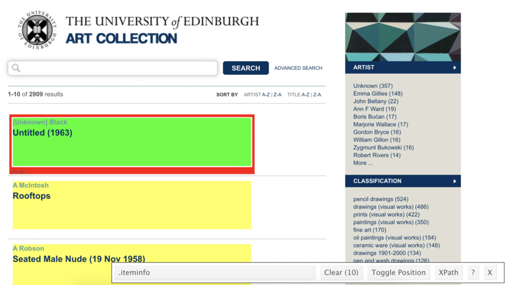

```{r setup, include=FALSE}
knitr::opts_chunk$set(eval = TRUE)
```

The University of Edinburgh Art Collection *"supports the world-leading research and teaching that happens within the University. Comprised of an astonishing range of objects and ideas spanning two millennia and a multitude of artistic forms, the collection reflects not only the long and rich trajectory of the University, but also major national and international shifts in art history."*.

See the collection [here](https://collections.ed.ac.uk/art) and note that there are 2970 pieces in the art collection we're collecting data on. Note that more pieces may have been added or some pieces may have been removed between when this lab was written and when you're working on it.


In this lab we'll scrape data on all art pieces in the [Edinburgh College of Art collection](https://collections.ed.ac.uk/art/search/*:*/Collection:%22edinburgh+college+of+art%7C%7C%7CEdinburgh+College+of+Art%22).

# Learning goals CHANGE OUT

-   Working with R scripts
-   Web scraping from a single page
-   Writing functions
-   Iteration by mapping functions
-   Writing data out

# Lab prep - Everybody in Group at Once

```{r selectorgadget, fig.margin = TRUE, echo = FALSE}
knitr::include_graphics("img/selectorgadget.png")
```

-   Download and install the SelectorGadget for your browser.
    Once you do, you should now be able to access SelectorGadget by clicking on the icon next to the search bar in your Chrome or Firefox browser.

    -   See [here](https://chrome.google.com/webstore/detail/selectorgadget/mhjhnkcfbdhnjickkkdbjoemdmbfginb) for Chrome 

-   Read the following on working with R Markdown documents vs. R scripts.

## R scripts vs. R Markdown documents

Today we will be using both R scripts and R Markdown documents:

-   `.R`: R scripts are plain text files containing **only** code and brief comments,

    -   We'll use R scripts in the web scraping stage and ultimately save the scraped data as a csv.

-   `.Rmd`: R Markdown documents are plain text files containing.

    -   We'll use an R Markdown document in the web analysis stage, where we start off by reading in the csv file we wrote out in the scraping stage.

Here is the organization of your files, and the corresponding section in this document that each file will be used for:

```{=plain}
|-data
|  |- README.md
|-lab-06-uoe-art.Rmd              # analysis
|-lab-06-uoe-art.Rproj
|-README.md
|-scripts                         # webscraping
|  |- 01-scrape-page-one.R        # scraping a single page
|  |- 02-scrape-page-function.R   # functions
|  |- 03-scrape-page-many.R       # iteration
```
# Getting started

Have the starting group member go to the course GitHub organization and locate the lab 08 repo, clone it in RStudio and open the R Markdown document.
Knit the document to make sure it compiles without errors.

## Warm up

Let's warm up with some simple exercises.
Update the YAML of your R Markdown file with your information, knit, commit, and push your changes.
Make sure to commit with a meaningful commit message.
Then, go to your repo on GitHub and confirm that your changes are visible in your Rmd **and** md files.
If anything is missing, commit and push again.

## Packages

We'll use the **tidyverse** package for much of the data wrangling and visualisation, the **robotstxt** package to check if we're allowed to scrape the data, the **rvest** package for data scraping.
These packages are already installed for you.
You can load them by running the following in your Console:

```{r eval = TRUE, message = FALSE}
library(tidyverse) 
library(robotstxt)
library(rvest)
```

## Data

This assignment does not come with any prepared datasets.
Instead you'll be scraping the data!
But before doing so, let's check that a bot has permissions to access pages on this domain.

```{r paths-allowed, warning=FALSE}
paths_allowed("https://collections.ed.ac.uk/artn")
```

# Exercises

## Scraping a single page

```{marginfigure}
**Tip:** To run the code you can highlight or put your cursor next to the lines of code you want to run and hit Command+Enter.
```


We will start off by scraping data on the first 10 pieces in the collection from [here](https://collections.ed.ac.uk/art/search/*:*/Collection:%22edinburgh+college+of+art%7C%7C%7CEdinburgh+College+of+Art%22?offset=0).

First, we define a new object called `first_url`, which is the link above.
Then, we read the page at this url with the `read_html()` function from the **rvest** package.
The code for this is already provided in `01-scrape-page-one.R`.

```{r}
# set url
first_url <- "https://collections.ed.ac.uk/art/search/*:*/Collection:%22edinburgh+college+of+art%7C%7C%7CEdinburgh+College+of+Art%22?offset=0"

# read html page
page <- read_html(first_url)
```

For the ten pieces on this page we will extract `title`, `artist`, and `link` information, and put these three variables in a data frame.

### Titles

Let's start with titles.
We make use of the SelectorGadget to identify the tags for the relevant nodes:

```{r iteminfo-h3a, fig.margin = TRUE, echo = FALSE}

```

```{r}
page %>%
  html_nodes(".iteminfo") %>%
  html_node(".record-title")
```

Then we extract the text with `html_text()`:

```{r}
page %>%
  html_nodes(".iteminfo") %>%
  html_node(".record-title") %>%
  html_text()
```

And get rid of all the spurious white space in the text with `str_squish()`, which reduces repeated whitespace inside a string.


```{r}
page %>%
  html_nodes(".iteminfo") %>%
  html_node(".record-title") %>%
  html_text() %>%
  str_squish()
```

And finally save the resulting data as a vector of length 10:

```{r}
titles <- page %>%
  html_nodes(".iteminfo") %>%
  html_node("h3 a") %>%
  html_text() %>%
  str_squish()
```

### Your turn: Try and use the scraped title text from above to scrape the artist

```{marginfigure}
**Tip:** The "eval=F" i the chunk name (between the { }) means if we *knit* this file it woun't evaluate the code in that chunk.
```

### Scrape Artist Names
```{r scrape_artist_names,eval = F}
artists <- page %>%
  html_nodes(".iteminfo") %>%
  html_node(".artist") %>%
  ___
```

### Links

The same nodes that contain the text for the titles also contains information on the links to individual art piece pages for each title.
We can extract this information using a new function from the rvest package, `html_attr()`, which extracts attributes.

A mini HTML lesson!
The following is how we define hyperlinked text in HTML:

    <a href="https://www.google.com">Seach on Google</a>

And this is how the text would look like on a webpage: [Seach on Google](https://www.google.com).

Here the text is `Seach on Google` and the `href` attribute contains the url of the website you'd go to if you click on the hyperlinked text: `https://www.google.com`.

The moral of the story is: the link is stored in the `href` attribute.

```{r}
page %>%
  html_nodes(".iteminfo") %>%   # same nodes
  html_node("h3 a") %>%         # as before
  html_attr("href")             # but get href attribute instead of text

```

Click on one of art piece titles in your browser and take note of the url of the webpage it takes you to. Think about how that url compares to what we scraped above? 

We need url's that R can follow to scrape. We can modify these URL's but we can't copy and paste these ones for R and get the correct page. How can we modify these links to have them route to an actual art piece? Not in code lanauge, what part of the link needs changed? 


We will use an R function `str_replace()` to fix the URLs. You may notice something special happening in the `pattern` to replace. We want to replace the `.`, but we have it as `\\.`. This is because the period `.` is a special character and so we need to *escape* it first with backslashes, `\\`s.

### Scrape Links
```{r scrape_links}
links <- page %>%
  html_nodes(".iteminfo") %>%
  html_node("h3 a") %>%
  html_attr("href") %>%
  str_replace("\\.", "https://collections.ed.ac.uk/art") #relace all the dot with this new text
links
```


### Put it altogether

```{r put_all_together,eval=F}
first_ten <- tibble(
  title = titles,
  artist = artists,
  link = links
)

```

### Scrape the next page

We have only scraped the first page but there are over 2000 pieces spread across many pages. 

On your browser, click to the next page, and grab its url. Fill in the blank in to define a new object: `second_url`. Copy-paste code from top of the R script to scrape the new set of art pieces, and save the resulting data frame as `second_ten`.

### Please paste your 2nd page of painting URL here
second_url <- "___"

page <- read_html(second_url)

```{r scrape_titles_2nd_page}
titles <- page %>%
  html_nodes(".iteminfo") %>%
  html_node("h3 a") %>%
  html_text() %>%
  str_squish()
titles
```

```{r scrape_artist_2nd_page}
artists <- page %>%
  html_nodes(".iteminfo") %>%
  html_node(".artist") %>%
  html_text() 
artists

```

```{r scrape_url_2nd_page}
links <- page %>%
  html_nodes(".iteminfo") %>%
  html_node("h3 a") %>%
  html_attr("href") %>%
  str_replace("\\.", "https://collections.ed.ac.uk/art")
links
```

```{r put_it_together_2nd_page}
second_ten <- tibble(
  title = titles,
  artist = artists,
  link = links
)
```

Is any of this code different from page 1? 


## Functions

You've been using R functions, now it's time to write your own!

Let's start simple.
Here is a function that takes in an argument `x`, and adds 2 to it.

```{r}
add_two <- function(x){
  x + 2
}
```

Let's test it:

```{r}
add_two(3)
add_two(10)
```

The skeleton for defining functions in R is as follows:

```{r eval=FALSE}
function_name <- function(input){
  # do something with the input(s)
  # return something
}
```

Then, a function for scraping a page should look something like:

```{marginfigure}
**Hint:** Function names should be short but evocative verbs.
```

```{r}
function_name <- function(url){
  # read page at url
  # extract title, link, artist info for n pieces on page
  # return a n x 3 tibble
}
```

Our function uses the code you already developed earlier. We name the function `scrape_page`.

```{r our_own_function}
scrape_page <- function(url){
  
  # read page
  page <- read_html(url)
  
  # scrape titles
  
  titles <- page %>%
html_nodes(".iteminfo") %>%
  html_node("h3 a") %>%
  html_text() %>%
  str_squish()
titles

  # scrape artists 

artists <- page %>%
  html_nodes(".iteminfo") %>%
  html_node(".artist") %>%
  html_text() 
artists

  # scrape links

  links <- page %>%
html_nodes(".iteminfo") %>%
  html_node("h3 a") %>%
  html_attr("href") %>%
  str_replace("\\.", "https://collections.ed.ac.uk/art")
links
  
  # create and return tibble
  tibble(
  title = titles,
  artist = artists,
  link = links
  )
  
}

```


When you run this chunk, check out the "Environment" tab of the top right panel. There should now be a new category called "Functions"

Test out your new function by running the following in the console. *You will need to copy and paste the URL's from the first and second web pages we used before

Does the output look right?

Discuss with table-mates whether you're getting the same results as before.

```{r eval=FALSE}
scrape_page(____first_URL______)
scrape_page(____second_URL_____)
```


## Iteration

We went from manually scraping individual pages to writing a function to do the same.
Next, we will work on making our workflow a little more efficient by using R to iterate over all pages that contain information on the art collection.


**Reminder:** The collection has 2970 pieces in total.

That means we give develop a list of URLs (of pages that each have 10 art pieces), and write some code that applies the `scrape_page()` function to each page, and combines the resulting data frames from each page into a single data frame with 2970 rows and 3 columns.

### List of URLs

Click through the first few of the pages in the art collection and observe their URLs to confirm the following pattern:

    [sometext]offset=0     # Pieces 1-10
    [sometext]offset=10    # Pieces 11-20
    [sometext]offset=20    # Pieces 21-30
    [sometext]offset=30    # Pieces 31-40
    ...
    [sometext]offset=2960  # Pieces 2961-2970

We can construct these URLs in R by pasting together two pieces: (1) a common (`root`) text for the beginning of the URL, and (2) numbers starting at 0, increasing by 10, all the way up to 2970.

Two new functions are helpful for accomplishing this: `glue()` for pasting two pieces of text and `seq()` for generating a sequence of numbers.

Fill in the blanks to construct the list of URLs.

```{r construct_URLs, eval =F}
root <- "https://collections.ed.ac.uk/art/search/*:*/Collection:%22edinburgh+college+of+art%7C%7C%7CEdinburgh+College+of+Art%22?offset="

# For time, lets only go up to 70
numbers <- seq(from = ___, to = ___, by = ___)
urls <- glue("{___}{___}")
```

### Mapping

Finally, we're ready to iterate over the list of URLs we constructed.
We will do this by **map**ping the function we developed over the list of URLs.
There are a series of mapping functions in R, and they each take the following form:

    map([x], [function to apply to each element of x])

In our case `x` is the list of URLs we constructed and the function to apply to each element of `x` is the function we developed earlier, `scrape_page`.
And as a result we want a data frame, so we use `map_dfr` function:

```{r eval=FALSE}
map_dfr(urls, scrape_page) #this applies a function to the urls object
```

Fill in the blanks to scrape all pages, and to create a new data frame called `uoe_art`.

```{r map_our_function,eval=F}
uoe_art <- map_dfr(__objects_we_want_to_apply_function_to___, ___our_function_name___)
```

### Item description

Now, for later use, I really want the items description. This information is not available on the search page like the other information we gather but it is available on each items individual page, which you created the links for. 

```{r scape_description}
add_description <- function(indv_page_url){
    read_html(indv_page_url) %>%
            html_node("tr:nth-child(5) span") %>%
            html_text()%>%
            str_squish()
  }

uoe_art <- uoe_art %>% mutate(description = map_chr(link,add_description))

```

### Write out data

Finally write out the data frame we constructed into the `data` folder so that you can use it in the analysis section.

```{r write_data,eval=F}
write_csv(uoe_art, file = "data/uoe-art.csv")
```


## Analysis
First, often you would clean up your R and before starting this stage. Let's do that. In the top right panel, click *environment*. Next click the little *broom*. This will clean out your environment. Note that if you did not save code creating something that that something will now be gone.

Now that we have a tidy dataset that we can analyze, let's do that! We need to reading packages and the data we created. 

### Load packages and data

```{r load-packages, message = FALSE}
library(tidyverse) 
library(skimr)
```

```{r load-data, message = FALSE, eval = TRUE}
# Remove eval = FALSE or set it to TRUE once data is ready to be loaded
uoe_art <- read_csv("data/uoe-art.csv")
```

We'll start with some data cleaning, to clean up the dates that appear at the end of some title text in parentheses.
Some of these are years, others are more specific dates, some art pieces have no date information whatsoever, and others have some non-date information in parentheses.

This should be interesting to clean up!

First thing we'll try is to separate the `title` column into two: one for the actual `title` and the other for the `date` if it exists.
In human speak, we need to

> "separate the `title` column at the first occurrence of `(` and put the contents on one side of the `(` into a column called `title` and the contents on the other side into a column called `date`"

Luckily, there's a function that does just this: `separate()`!

And once we have completed separating the single `title` column into `title` and `date`, we need to do further clean-up in the `date` column to get rid of extraneous `)`s with `str_remove()`, capture year information, and save the data as a numeric variable.

**Hint:** Remember escaping special characters from earlier? We'll need to use that trick again.

Here we are using our new functions and the separate, mutate, and select dplyr functions we spoke about earlier. Note that this will result in some warnings when you run the code, and that's OK! Read the warnings, and explain what they mean, and why we are ok with leaving them in given that our objective is to just capture `year` where it's convenient to do so.

```{r separate-title-date, error = TRUE}
uoe_art <- uoe_art %>%
  separate(title, into = c("title", "date"), sep = "\\(") %>%
  mutate(year = str_remove(date, "\\)") %>% 
  as.numeric()) %>%
  select(title, artist, year, date, description)
uoe_art
```

This will print out a summary of the data frame using the `skim()` function. How many pieces have artist info missing? How many have year info missing?

```{r summary}
skim(uoe_art)
```


Next we make a histogram of years. Use a reasonable binwidth. Do you see anything out of the ordinary?

```{r histogram}

ggplot(uoe_art, aes(x = year)) +
  geom_histogram(binwidth = 10)

```


Who is the most commonly featured artist in the collection? Do you know them? 

The *count* function will simply count the number of rows each artist has in our dataset. 
```{r popular_artist}
uoe_art%>%
  count(artist, sort = TRUE)
```


How many art pieces have the word "child" in their title? Try to figure it out, and ask for help if you're stuck.

```{r child}
uoe_art%>%
  filter(str_detect(title,"Child"))
```


## Basic Text Analysis

## Packages
In addition to `tidyverse` we will be using other packages today

```{r packages, echo=FALSE, message=FALSE, warning=FALSE}
library(tidyverse)
library(tidytext)
library(wordcloud)# Making wordclouds
library(DT) 
library(stopwords)
```

## Tidytext

- Using tidy data principles can make many text mining tasks easier, more effective, and consistent with tools already in wide use.
- Learn more at <https://www.tidytextmining.com/>.

## What is tidy text?

```{r}
text <- uoe_art$description[1] # This just selects the first row description

text
```

```{r}
text_df <- tibble(line=1,text = text)

text_df
```

```{r}
text_df %>%
  unnest_tokens(word, text)
```

#### Turn all of our descriptions into tidy text, and look for commonalities

```{r}
uoe_art %>%
  unnest_tokens(word, description) %>%
  count(word, sort = TRUE)
```

#### Stop words

- In computing, stop words are words which are filtered out before or after processing of natural language data (text).
- They usually refer to the most common words in a language, but there is not a single list of stop words used by all natural language processing tools.


#### English stop words

```{r}
get_stopwords()
```


#### Spanish stop words

```{r}
get_stopwords(language = "es")
```

#### Various lexicons

See `?get_stopwords` for more info.

```{r}
get_stopwords(source = "smart")
```

#### Back to looking for commonalities

```{r}
uoe_art %>%
  unnest_tokens(word, description) %>%
  anti_join(stop_words)%>%
  count(word, sort = TRUE)

```

#### Top 20 common words in the descriptions
```{r message=FALSE}
top20_words <- uoe_art %>%
  unnest_tokens(word, description) %>%
  anti_join(stop_words) %>%
  count(word) %>%
  top_n(20)

top20_words %>%
  arrange(desc(n))
```

#### Visualizing commonalities: bar chart
```{r}
top20_words %>%
  ggplot(aes(x = fct_reorder(word, n), y = n)) +
  geom_col() +
  labs(x = "Common words", y = "Count") +
  coord_flip()
```

#### Visualizing commonalities: wordcloud

```{r}
set.seed(1234)
wordcloud(words = top20_words$word, 
          freq = top20_words$n, 
          colors = brewer.pal(5,"Blues"),
          random.order = FALSE)
#Note: You may need to increase the size of your plot area to get this to display properly
```


## N-grams... and BEYOND

N-grams are connections of words.

```{r}
tidy_ngram <- uoe_art %>%
  unnest_tokens(input = description,output=bigram,token="ngrams",n=2)%>%   #<
  dplyr::filter(!is.na(bigram))

tidy_ngram
```

#### What are the most common bigrams?

What found do we use to count items? 

```{r}
tidy_ngram %>%
  ____(bigram,sort = T)       #<
```

#### Let's use `separate()` from tidyr to remove stop words.

```{r}
bigram_counts <- tidy_ngram %>%
  separate(bigram,c("word1","word2"),sep=" ") %>%
  filter(!word1 %in% stop_words$word,
         !word2 %in% stop_words$word) %>%
  count(word1, word2, sort = TRUE)

bigram_counts
```

### Free time! We can explore more down either direction. 